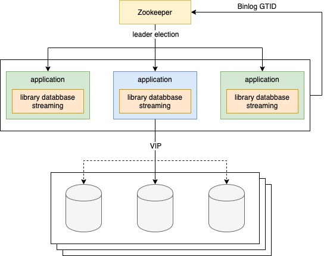

# Library
包含通用基础模块汇总，以便基于这些模块快速开发，包含
* 数据库日志同步
* 有状态服务调度

## 数据库日志同步
* 采用解析MySQL binlog方式获取日志中的事件
* 通过MySQL GTID模式保证MySQL主库宕机时能继续从从库消费日志（需要配MySQL VIP）
* 使用主从模式，使用Zookeeper选主保证多点部署时不重复消费MySQL日志
* 已消费事件的GTID更新到Zookeeper，保证主从切换时可从上次的GTID继续消费

## 设计图

* 集成database-event-stream的应用通过Zookeeper选主，只有主节点与数据库建立长连接
* database-event-stream伪装为MySQL从节点，获取binlog事件
* database-event-stream定时更新当前消费的最新MySQL GTID到Zookeeper
* 应用重启或重新选主时，自动从Zookeeper获取MySQL GTID，避免binlog事件重复消费

### 单库同步
使用 `database-event-stream-spring` 依赖时，默认同步单库日志，从 `spring.datasource` 配置中获取数据库配置。

```yaml
library.database.stream:
  cluster.name: consistency  # 服务集群名，每个库须唯一，存储GTID时用于命名Zookeeper节点
  participant.id: watcher    # 参与选主的候选人ID，一个主从集群中须唯一
  zk.address: localhost:2181
  update:
    mode: blocking           # 更新GTID的方式，默认为异步 (async)
    interval: 200            # 异步更新延时，默认每200毫秒更新一次
  mysql.serverId: 0          # MySQL从库的ID，每个库须唯一
```

### 多库同步
使用 `database-event-stream-spring` 依赖时，开启同步多库日志时，从如下配置中获取数据库配置，忽略 `spring.datasource`。
```yaml
library.database.stream.multi:
  enabled: true              # 默认为false             
  participant.id: watcher    # 参与选主的候选人ID，一个主从集群中须唯一
  zk.address: localhost:2181
  update:
    mode: blocking           # 更新GTID的方式，默认为异步 (async)
    interval: 200            # 异步更新延时，默认每200毫秒更新一次
  contexts:                  # 多库的配置
  - datasource:
      url: jdbc:mysql://localhost:3316/consistency1?useSSL=false
      username: root1
      password: password1
    cluster.name: consistency1 # 服务集群名，每个库须唯一，存储GTID时用于命名Zookeeper节点
  - datasource:
      url: jdbc:mysql://localhost:3316/consistency2?useSSL=false
      username: root2
      password: password2
    cluster.name: consistency2 # 服务集群名，每个库须唯一，存储GTID时用于命名Zookeeper节点
```

## 使用方法
1. 添加依赖
    ```
          <dependency>
            <groupId>com.syswin.library</groupId>
            <artifactId>database-event-stream-spring</artifactId>
            <version>xxx</version>
          </dependency>
    ```
1. 自定义如下三个Bean
    ```java
      // 需解析的数据库事件，未添加的则抛弃
      @Bean
      EventType[] eventTypes() {
        return new EventType[]{TABLE_MAP, EXT_WRITE_ROWS};
      }
    
      // 事件处理器，按库区分
      @Bean
      Function<DataSource, Consumer<Event>> eventConsumerSupplier() {
        return dataSource -> new MysqlEventHandler(events, "listener_event");
      }
    
      // 自定义的其他需要选主的任务，如清理同步完事件的表，按库区分
      @Bean
      StatefulTaskSupplier statefulTaskSupplier() {
        return dataSource -> new MyStatefulTask();
      }
    ```
